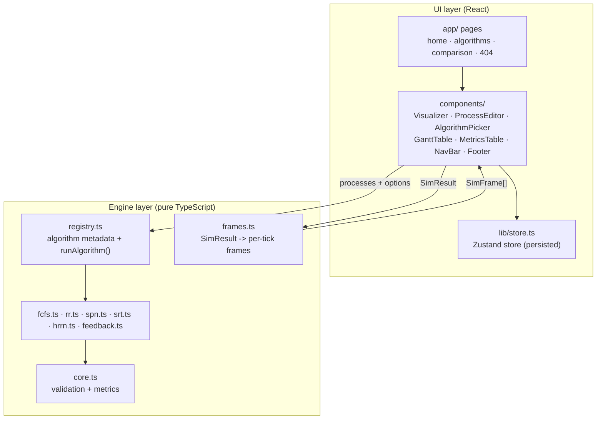

# Architecture

The application is a fully client-side Next.js (App Router) site with a strict
separation between the **scheduling engine** (pure TypeScript, framework-free)
and the **UI layer** (React components). There is no backend: the build emits
static files (`output: "export"`).

## Layer overview

The UI never implements scheduling logic. It calls `runAlgorithm()` once per
input change and *replays* the returned result — this is what makes stepping,
scrubbing and replay trivial and keeps every policy unit-testable.

## Engine layer — `src/lib/scheduler/`

| Module | Responsibility |
| --- | --- |
| `types.ts` | `ProcessInput`, `Segment`, `SimEvent`, `SimResult`, `QueueSnapshot`, `SimFrame`, algorithm metadata types |
| `core.ts` | `validateProcesses()` (throws on invalid input) and `finalize()` (per-process metrics + summary means + makespan) |
| `fcfs.ts`, `spn.ts`, `hrrn.ts` | Non-preemptive family: pick next job at each completion, run to completion |
| `srt.ts` | Preemptive shortest-remaining-time with arrival-time tie-breaks |
| `rr.ts` | FIFO round robin with quantum; emits a `queueTimeline` of ready-queue snapshots |
| `feedback.ts` | Multilevel feedback queues; per-level quanta; emits `queueTimeline` with levels |
| `frames.ts` | `buildFrames()` — converts a `SimResult` into one `SimFrame` per clock tick (`t = 0..makespan`), including running process, ready queue, remaining times, completed set and tick events |
| `registry.ts` | `ALGORITHMS` metadata (name, decision mode, selection function, `how` steps, `note`), `LECTURE_EXAMPLE`, `runAlgorithm()` |

Engines are deterministic and side-effect free: same input always yields the
same `SimResult`. They import nothing from `app/` or `components/`.

## UI layer

- `src/app/` — route-level pages, `loading.tsx` skeletons, `not-found.tsx`,
  global styles, SEO metadata routes (`robots.ts`, `sitemap.ts`).
- `src/components/` — one folder per component (`X.tsx` + `X.module.scss`).
  Key composition: `Visualizer` orchestrates `AlgorithmPicker`,
  `ProcessEditor`, `GanttTable`, `MetricsTable` and the playback state machine.

## State management

A single Zustand store (`src/lib/store.ts`) holds the user's session:

- `processes`, `algorithm`, `quantum`, `fbPreset` plus actions
  (`updateProcess`, `addProcess`, `removeProcess`, `resetProcesses`, setters).
- Persisted to `localStorage` under key `csv-sim` with
  `skipHydration: true`; pages call `useStoreHydration()` which rehydrates and
  gates rendering until ready (skeletons render before that). This avoids
  SSR/client markup mismatches.
- The theme is separate: `data-theme` on `<html>`, set pre-paint by an inline
  script, persisted under `csv-theme`. Light is the default.

## Design decisions

1. **Event-sourced simulation.** Engines emit segments + a narrated event log
   (+ queue snapshots) instead of the UI sampling a live simulation. Benefits:
   deterministic golden tests, free time travel (step back), and a narration
   log for learners.
2. **Frames as the playback contract.** `buildFrames()` is the only bridge
   between a finished `SimResult` and the tick-by-tick UI; adding a new
   algorithm requires no playback changes if it produces a correct `SimResult`.
3. **Static export.** No server features are used, so the site deploys to any
   static host (see [deployment](./deployment.md)).
4. **Golden fixtures as specification.** The engines are pinned to the classic
   five-process worked example; tests fail if behavior drifts (see
   [algorithms](./algorithms.md) and [contributing](./contributing.md)).
5. **Accessibility as a constraint, not a feature.** Contrast-checked tokens,
   skip link, table captions/scopes, `role="alert"` errors, focus-visible
   outlines and reduced-motion support are built into the shared styles and
   components.
