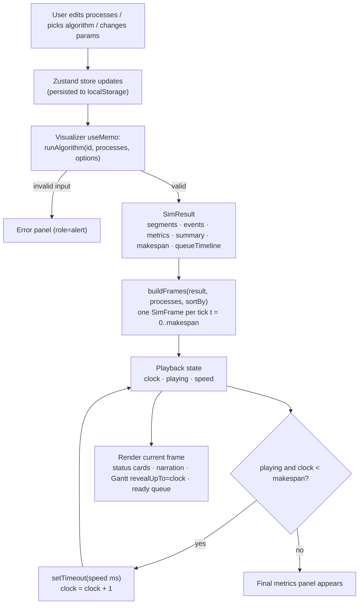

# System flow

How data moves from the user's process list to the pixels on screen.

## End-to-end flow

## Simulation lifecycle

1. **Input.** The process list lives in the Zustand store. Every row is
   validated continuously (`processRowError`): unique non-empty names,
   integer arrival 0–999, integer service 1–500. Invalid lists disable the
   simulation and show an error panel.
2. **Run.** Changing any input re-runs `runAlgorithm()` (memoized). The engine
   validates again (throws are caught), simulates to completion and returns a
   `SimResult`:

   - `segments` — CPU allocation intervals, with feedback queue `level` and an
     `endedBy` reason (`completed`, `quantum-expired`, `preempted`)
   - `events` — a narrated log (`arrive`, `dispatch`, `complete`,
     `quantum-expired`, `preempt`, `idle`) with human-readable `detail` text
   - `metrics` + `summary` — finish, turnaround (Tr), Tr/Ts, waiting per
     process, plus means
   - `queueTimeline` (RR/Feedback) — ready-queue snapshots recorded at every
     queue mutation, used to reconstruct exact FIFO/level order per tick
   - `makespan` — total timeline length

3. **Framing.** `buildFrames()` projects the result into `makespan + 1`
   frames. Frame `t` describes the world at the *start* of unit
   `[t, t+1)`: running process (and level), ordered ready queue (from the
   queue timeline for RR/FB, or derived and sorted for the non-preemptive
   family), remaining times, completed set, events at `t`, and processes that
   finished exactly at `t`.
4. **Playback.** The Visualizer holds `clock` (0..makespan), `playing` and
   `speed` (0.5×–2×). A timer effect advances the clock one tick at a time and
   stops automatically at the end. Editing any input resets the clock.
5. **Rendering.** The current frame drives:
   - status cards (clock, active process + level, remaining time)
   - narration chips (arrivals, preemptions, completions)
   - `GanttTable` with `revealUpTo={clock}` (cells fill in as the clock
     advances; the current column is outlined)
   - the ready-queue strip under the chart
   - the final metrics table once `clock === makespan`

## Worked example (Round Robin, q = 1)

Classic five-process workload (A–E: arrivals 0, 2, 4, 6, 8; service 3, 6, 4, 5, 2):

| t | Running | Ready queue after dispatch | Note |
| --- | --- | --- | --- |
| 0 | A | — | A's first quantum |
| 1 | A | — | uncontended quantum, A stays at front |
| 2 | B | A | B arrived at t=2 and enqueues **before** A rejoins |
| 3 | A | B | A completes at t=4 |
| 4 | B | C | C arrived at t=4; A finished |

The same replay drives the Gantt table: column `t+1` of row `A` fills when the
frame at `t` reports `running = A`.

## Idle handling

When no process is ready, engines emit an `idle` event and jump the clock to
the next arrival; frames for idle ticks show `running = null` and the status
card reads IDLE.
